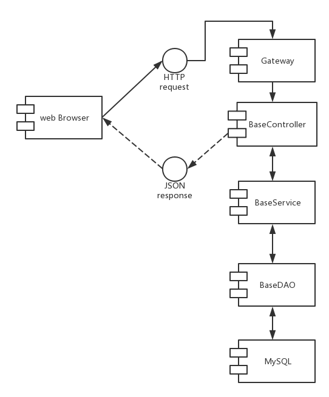
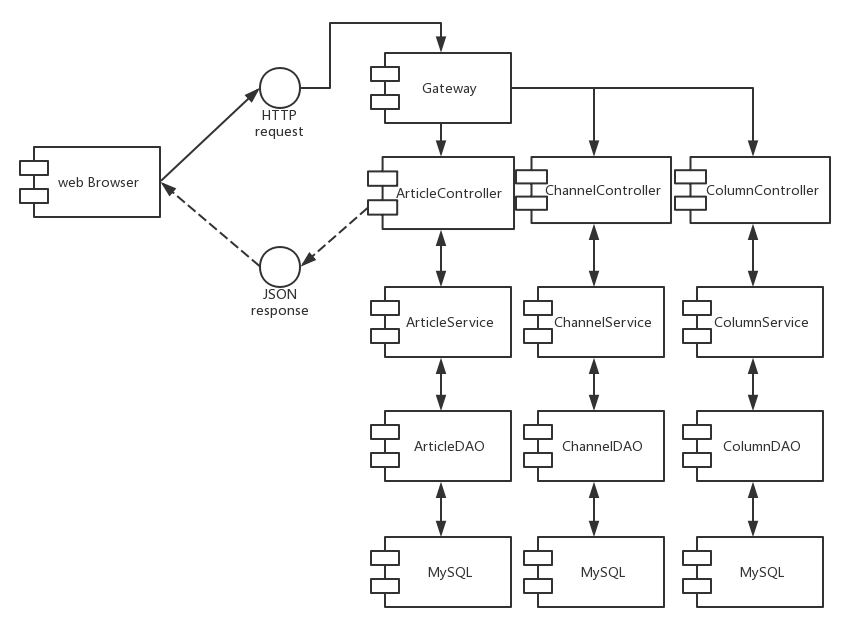
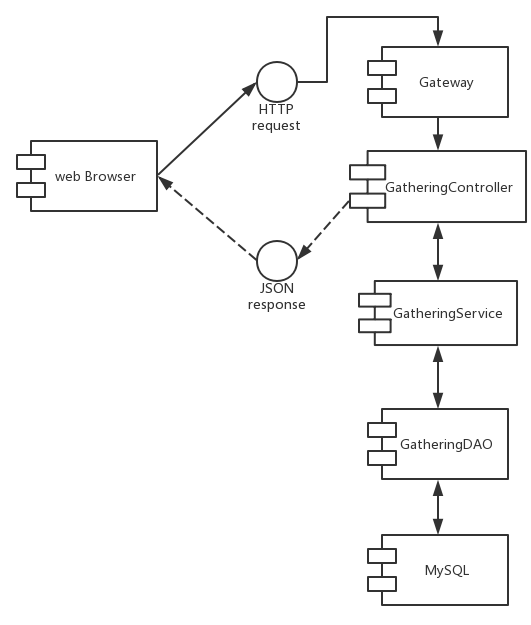
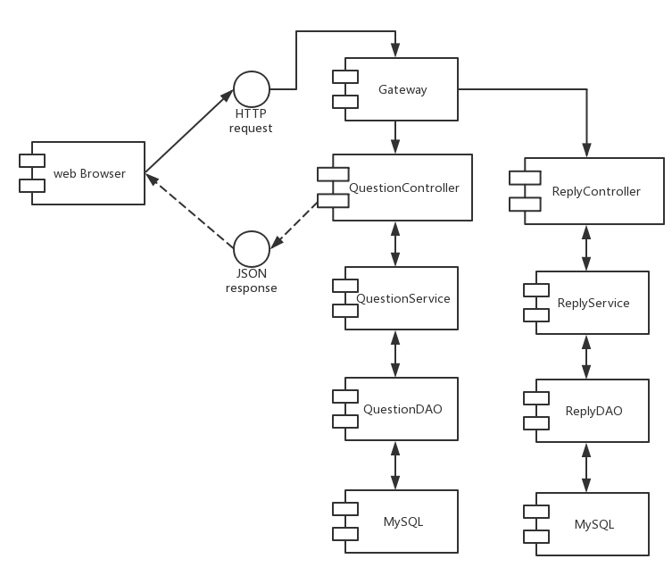
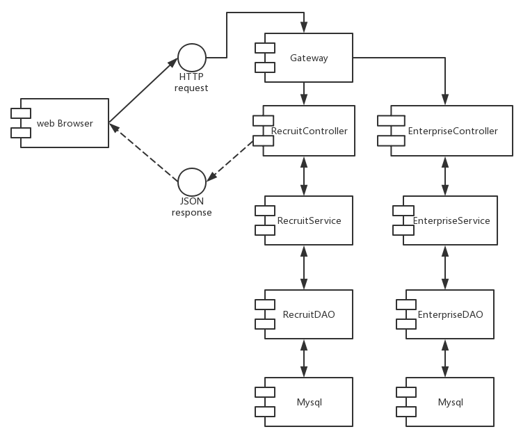
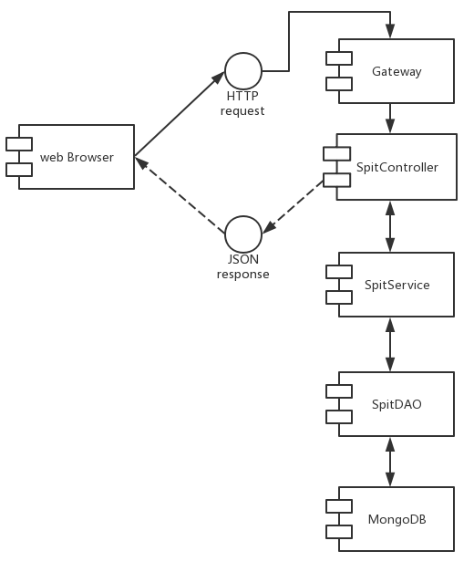
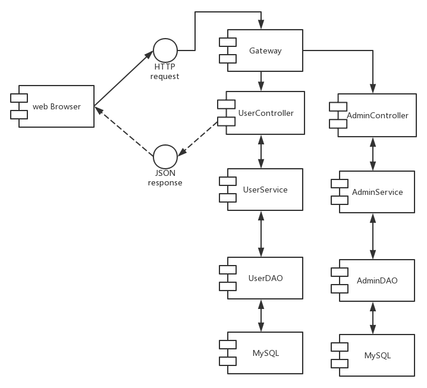

<h1>
    
CoderHub

</h1>

>1651701 Wei Nan
>
>1650527 Cai Zhendong
>
>161718 Fang Pei
>
>1651200 Pu Jiarui

## 1.Introduction

1. Project Name: CoderHub

2. Introduction：

   ​	CoderHub is a **multi-functional** social platform for programmers. It includes 5 functional modules

   + Hot: Share and view articles 
   + QA: Publish and answer questions
   + Gathering: find popular activities and lectures
   + Spit: All sorrow and joy
   + Recruitment: Seek for job and enterprise. 

   ​     Meanwhile CoderHub provides management backend for administrator to maintain the web.

3. Team Members:

   1651701 Wei Nan

   1650527 Cai ZhenDong

   1651200 Pu Jiarui

   1651718 Fang Pei

4. Contact Number: 18916107060

5. Email Address: 154544017@qq.com

## 2.System Functionalities

### 2.1 general user

##### 2.1.1 Account functions

 2.1.1.1 Registry

1. Fill in nickname, mobile phone number.

2. Get verification code sent by Alibaba Cloud SMS Service
3. Fill in password
4. Register successfully

2.1.1.2 Login

1. Fill in mobile number, password
2. Login successfully an get token

2.1.1.3 Logout

​	Clear token and exit.

##### 2.1.2 Hot

  2.1.2.1 Get channel

​	The headlines are categorized by channel, and users can choose different channels, such as machine learning, front-end development, and so on.

  2.1.2.2 View the hottest article

​	Users can browse the headlines of a particular channel by selecting a particular channel. Implemented waterfall loading function, users can pull down to load more articles.

  2.1.2.3 View the details of headlines

​	Users can select a headline article to view the article details and information about the user who posted the article.

  2.1.2.4 Publish Headlines

​	The user can fill in the title and article content to upload the article, and the article is published after being reviewed by the administrator.

##### 2.1.3 QA

  2.1.3.1 Get tags

​	 Each question is tagged with a specific tag, such as Java, C ++, etc. The user can select a tag to browse different kinds of questions.

  2.1.3.2 View the new answers

​	Users can view the questions under the specified label, which are sorted by time. Implemented the waterfall loading function.

  2.1.3.3 View the hot answers

​	Users can view the questions under the specified label, which are sorted by the number of answers. Implemented the waterfall loading function.

  2.1.3.4 View questions not answered

​	Users can view the questions not yet answered under the specified label

  2.1.3.5 Check the QA details

​	Users can view the details of a question and answer, such as the publisher, and a list of answers.

  2.1.3.6 Answer questions

​	Users can write answers on the detail page。

  2.1.3.7 Publish questions

​	Users can fill in titles, tags, content (supports rich text editing like code blocks, etc.) and post questions

##### 2.1.4 Activity

  2.1.4.1 Browse the latest events

​	Users can view all activities posted on CoderHub. Implemented the waterfall loading function.

  2.1.4.2 View event details

​	Users can view the start event, end time, organizer, event introduction and other details of the event.

##### 2.1.5 Spit

  2.1.5.1 View spits

​	Users can view all the spits

  2.1.5.2 Thumb up

​	Users can give spit a thumb up on the browse list interface.

  2.1.5.3 Check spits

​	The user can view the details of the spit and comment on the slot.

  2.1.5.4 Review spits

​	The user can comment on the spits by clicking the comment button on the slot detail page.

  2.1.5.5 Publish spits

​	Users can edit spits to publish.

##### 2.1.6 Recruitment

  2.1.6.1 View recruitment information

​	Users can view recommended and newest chances

  2.1.6.2 View the hottest enterprise.

​	Users can view the hottest enterprise

  2.1.6.3 View Recruitment Details

​	Users can view the salary, requirements, job descriptions and job requirements of the recruitment information as well as the introduction of the company.

  2.1.6.4 View company details

​	Users can view company labels, introductions, homepages and more.

##### 2.1.7 Person Center

  2.1.7.1 View my answer

​	Users can answer questions I have answered.

  2.1.7.2 View my questions

​	Users can see the questions I asked.

  2.1.7.3 View personal information

​	Users can view their profile, personal homepage, email and other information.

  2.1.7.4 Edit personal information

​	Users can modify their profile, personal homepage, email and other information.

### 2.2 Administrator

##### 2.2.1 Account

  2.2.1.1 Administrator login

​	Input account(admin) and code(123456) to login，get token。

  2.2.1.2 Logout

​	Clear token and go back to the login page.

##### 2.2.2 Activity Management 

  2.2.2.1 See all events

​	The administrator can view all activities in the database.

  2.2.2.2 Edit event information

​	The administrator can modify the event information (name, location, etc.), and can set whether the event is visible (whether it is displayed to the front page).

  2.2.2.3 Delete event information

​	Administrators can delete events.

  2.2.2.4 Add event information

​	Administrators can add activities and choose whether they are visible.

##### 2.2.3 Recruitment Management

   2.2.3.1 View all registered enterprises

​	The administrator can view all enterprise information in the database.

   2.2.3.2 Modify Enterprise Information

​	The administrator can modify the company's information (name, profile, etc.), and can set whether the company is popular (whether to show the hot companies in the foreground).

   2.2.3.3 Delete Enterprise Information

​	Administrators can delete corporate information.

   2.2.3.4 New Enterprise

​	Administrators can add new enterprise information and choose whether it is popular.

   2.2.3.5 View all registered job postings

​	The administrator can view all recruitment information in the database.

   2.2.3.6 Modify Recruitment Information

The administrator can modify the recruitment information (name, requirements, etc.), and can decide whether the recruitment is visible (whether the front desk is displayed).

   2.2.3.7 Delete Job Information

​	The administrator can delete job postings.

   2.2.2.8 New recruitment information

​	Administrators can add recruitment information to existing enterprises and choose whether they are visible.

##### 2.2.4 Article Management

   2.2.4.1 View all channels

​	The administrator can view all channels in the database.

   2.2.4.2 Modify Channel Information

​	The administrator can modify the channel information and set whether the channel is visible

   2.2.4.3 Delete Channel Information

​	The administrator can delete a channel.

   2.2.4.4 Add Channel

​	The administrator can add new channels and choose whether they are visible.

   2.2.4.5 View all column information

​	The administrator can view all column information in the database.

   2.2.4.6 Review column information

​	The administrator can review user-submitted columns so that they can be created and displayed on the front end.

   2.2.2.7 See all articles

​	Administrators can view existing and pending articles.

   2.2.2.8 Review Article

​	The administrator reviews the article applied for publishing, so that it can be displayed on the front end, and sets whether to stick it to the top bar.

   2.2.2.9 Delete Article

​	When an administrator reviews an article for publication, the administrator can delete the article.

## 3.User Manual 

### 3.1 Scenarios 

##### 3.1.1 Attentions

​	Because of the low server performance，so `Network Error，timeout of 3000ms` may appear in the viewing，just refresh the page. Contacting administrator is another way. 

- 
- 
- 
- 

##### 3.1.2 User page

###### 3.1.2.1 Register/Login

+ Click the `请登录` on the right up corner and enter the Register/Login page.

- 

  Enter nickname, phone  umber and verification will be sent.(Ignore the fail 500 error)

- 

  Check the verification.

- 

  Enter the verification code and password to complete the registration (Ignored `fail 500` error, registration has been completed)

- 

  Login in with registered account or use `18916107060(123456)` as demo where some answers and questions are embedded in.

###### 3.1.2.2 Article

1. Change channels

   

   ​	The headline articles are divided into different channels. You can browse different articles by switching channels.

2. View articles

   

   ​	Dynamically load articles through the drop-down, click to view the article details and the author information of the published article.

3. Publish articles

   

   ​	Click Publish to share, you can edit the article, realize rich text editing, you can upload pictures, format text, etc. Posts can be reviewed by the administrator after uploading.
###### 3.1.2.2 QA

1. View questions

   

   ​	Questions have different tags depending on the type, and you can select a tag to switch. The questions in each label are arranged in three ways: latest answer, hottest answer, and waiting answer. Click on a question to see the details of the question and answer.

2. Answer questions

   

   ​	Below the question users can fill in their own answers and support rich text editing.

4. Publish questions

   

   Users can post questions and label them. Supports rich text editing.
###### 3.1.2.3 Activity

1. Browse events and view event details

   

   ​	Users can browse the activities posted by the administrator, and you can load more activities dynamically. Click on the event to get the details of the event.

###### 3.1.2.4 Spit

1. Browse spit and view spit details

   

   ​	Users can browse the spit published by other users. Click on the spit to get the details and comments of the spit.
   
2. Comment spit

   

   ​	You can comment a spit in the spit detail page.

3. Thumb up

   Users can give a spit thumb up in the browser list page.

###### 3.1.2.5 Recruitment

1. View recruitment information

   ​	

   ​	Users can browse the newest and recommend jobs and click on it to get the detailed information about this job.

2. View enterprise information

   ​	Users can browse the hot enterprises and click on it to get the detailed information.

###### 3.1.2.6 Person Center

1. View personal information, personal questions and personal answers

   

2. Edit personal information

   

   ​	Users can modify their profile, personal homepage, email and other information.

##### 3.1.3 Administrator

######  3.1.3.1 Administrator login

​	account:admin

​	password:123456

###### 3.1.3.2 Activity management

1. Change activities

   

2. Delete activities

   

3. Add activities

   

###### 3.1.3.3 Recruitment

​	Enterprise management and recruitment management are similar to that in activity management.

`Attention`：When add a picture for new business，because we use ***jsonplaceholder.typicode.com*** to help save pictures，generally it depends on the network

###### 3.1.3.4 Article management

1. Channel management is the same as activity management.

2. Article review

   

3. Adding the column is like adding new activity as before, and the review is the same as the article review.

### 3.2  System Deployment and Configurations

##### 3.2.1 CoderHub  User Frontend

1. Unzip CoderHub.zip
2. The relevance: npm install
3. Start the program: npm run dev

##### 3.2.2 CoderHub Management Backend

1. Unzip CoderHubManagement.zip
2. The relevance: npm: npm install
3. Start: npm run dev/npm run start

#####  3.2.3 Server-side System 

​	The server of the project has been deployed to Tencent cloud.

​	IP: 106.54.231.68, the user frontend service port is 9012, and the management  backend service port is 9011.

## 4.System Architecture and Component Design

### 4.1 System Architecture

.png)

### 4.2 Component Design

##### 4.2.1 Base Component

##### 4.2.2 Article Component

##### 4.2.3 Gathering Component

##### 4.2.4 Q&A Component

##### 4.2.5 Recruit Component

##### 4.2.6 Spit Component

##### 4.2.7 User Component

## 5.Database Design

### 5.1 database:article 

1. tb_article

| field name | data type | length | field description            | note        |
| ---------- | --------- | ------ | ---------------------------- | ----------- |
| id         | varchar   | 20     | article id                   | primary key |
| columnid   | varchar   | 20     | column id                    |             |
| title      | varchar   | 100    | article title                |             |
| content    | text      |        | article content              |             |
| image      | varchar   | 100    | article cover                |             |
| createtime | datetime  |        | published date               |             |
| updatetime | datetime  |        | updated date                 |             |
| ispublic   | varchar   | 1      | is public                    |             |
| istop      | varchar   | 1      | is top                       |             |
| visits     | int       | 20     | page view                    |             |
| thumbup    | int       | 20     | number of thumbup            |             |
| comment    | int       | 20     | number of comments           |             |
| state      | varchar   | 1      | is approved                  |             |
| channelid  | varchar   | 20     | subordinate to which channel |             |

2. tb_channel

| field name | data type | length | field description       | note        |
| ---------- | --------- | ------ | ----------------------- | ----------- |
| id         | varchar   | 20     | id                      | primary key |
| name       | varchar   | 100    | the name of the channel |             |
| state      | varchar   | 1      | is approved             |             |

3. tb_column

| field name | data type | length | field description   | note        |
| ---------- | --------- | ------ | ------------------- | ----------- |
| id         | varchar   | 20     | ID                  | primary key |
| name       | varchar   | 100    | column name         |             |
| summary    | varchar   | 1000   | column introduction |             |
| userid     | varchar   | 20     | user id             |             |
| createtime | datetime  |        | create date         |             |
| checktime  | datetime  |        | check date          |             |
| state      | varchar   | 1      | is approved         |             |

### 5.2 database:base

1. tb_city

| field name | data type | length | field description | note        |
| ---------- | --------- | ------ | ----------------- | ----------- |
| id         | varchar   | 20     | id                | primary key |
| name       | varchar   | 20     | city name         |             |
| ishot      | varchar   | 1      | is hot            |             |

2.  tb_label

| field name | data type | length | field description | note        |
| ---------- | --------- | ------ | ----------------- | ----------- |
| id         | varchar   | 20     | label id          | primary key |
| labelname  | varchar   | 100    | label name        |             |
| state      | varchar   | 20     | is approved       |             |
| recommend  | varchar   | 20     | is recommendable  |             |

### 5.3 database:gathering

1. tb_gathering

| field name | data type | length | field description     | note        |
| ---------- | --------- | ------ | --------------------- | ----------- |
| id         | varchar   | 20     | id                    | primary key |
| name       | varchar   | 100    | activity name         |             |
| summary    | text      |        | activity introduction |             |
| detail     | text      |        | details               |             |
| sponsor    | varchar   | 100    | sponsor               |             |
| Image      | varchar   | 100    | activity image        |             |
| starttime  | datetime  |        | begin time            |             |
| endtime    | datetime  |        | end time              |             |
| address    | varchar   | 100    | address               |             |
| enrolltime | datetime  |        | registration deadline |             |
| state      | varchar   | 1      | is visible            |             |
| city       | varchar   | 20     | city                  |             |

### 5.4 database:qa

1. tb_pl

| field name | data type | length | field description | note        |
| ---------- | --------- | ------ | ----------------- | ----------- |
| problemid  | varchar   | 20     | problem id        | primary key |
| labelid    | varchar   | 20     | label id          |             |

2. tb_problem

| field name | data type | length | field description       | note        |
| ---------- | --------- | ------ | ----------------------- | ----------- |
| id         | varchar   | 20     | id                      | primary key |
| title      | varchar   | 100    | title                   |             |
| content    | text      |        | content                 |             |
| createtime | datetime  |        | create date             |             |
| updatetime | datetime  |        | update date             |             |
| userid     | varchar   | 20     | user id                 |             |
| Nickname   | varchar   | 100    | nickname                |             |
| visits     | bigint    | 20     | number of being visited |             |
| thumbup    | bigint    | 20     | thumbup                 |             |
| reply      | bigint    | 20     | reply number            |             |
| replytime  | datetime  |        | reply time              |             |
| labellist  | varchar   | 50     | the list of label       |             |

3. tb_reply

| field name | data type | length | field description            | note        |
| ---------- | --------- | ------ | ---------------------------- | ----------- |
| id         | varchar   | 20     | number                       | primary key |
| problemid  | varchar   | 20     | problem id                   |             |
| content    | text      |        | answer                       |             |
| createtime | datetime  |        | create date                  |             |
| updatetime | datetime  |        | update date                  |             |
| userid     | varchar   | 20     | id of user who answers       |             |
| Nickname   | varchar   | 100    | nickname of user who answers |             |

### 5.5 database:recruit

1. tb_enterprise

| field name | data type | length | field description   | note        |
| ---------- | --------- | ------ | ------------------- | ----------- |
| id         | varchar   | 20     | id                  | primary key |
| name       | varchar   | 100    | enterprise name     |             |
| summary    | varchar   | 1000   | introduction        |             |
| address    | varchar   | 100    | business address    |             |
| labels     | varchar   | 100    | labels list         |             |
| coordinate | varchar   | 100    | coordinate          |             |
| ishot      | varchar   | 1      | ishot               |             |
| logo       | varchar   | 100    | logo                |             |
| jobcount   | int       | 11     | number of positions |             |
| url        | varchar   | 100    | web url             |             |

2. tb_recruit

| field name  | data type | length | field description      | note        |
| ----------- | --------- | ------ | ---------------------- | ----------- |
| id          | varchar   | 20     | id                     | primary key |
| jobname     | varchar   | 100    | job title              |             |
| salary      | varchar   | 100    | salary range           |             |
| mycondition | varchar   | 100    | experience required    |             |
| education   | varchar   | 100    | education requirements |             |
| address     | varchar   | 100    | office address         |             |
| eid         | varchar   | 20     | business ID            |             |
| createtime  | datetime  |        | create date            |             |
| state       | varchar   | 1      | is approved            |             |
| label       | varchar   | 100    | label                  |             |
| content1    | varchar   | 100    | job description        |             |
| content2    | varchar   | 100    | job requirement        |             |

### 5.6 database:user

1. tb_admin

| field name | data type | length | field description | note        |
| ---------- | --------- | ------ | ----------------- | ----------- |
| id         | varchar   | 20     | id                | primary key |
| loginname  | varchar   | 100    | login name        |             |
| password   | varchar   | 100    | password          |             |
| state      | varchar   | 1      | state             |             |

2. tb_user

| field name  | data type | length | field description   | note        |
| ----------- | --------- | ------ | ------------------- | ----------- |
| id          | varchar   | 20     | id                  | primary key |
| mobile      | varchar   | 100    | mobile phone number |             |
| password    | varchar   | 100    | password            |             |
| Nickname    | varchar   | 100    | nickname            |             |
| sex         | varchar   | 2      | sex                 |             |
| Birthday    | datetime  |        | birthday            |             |
| avatar      | varchar   | 100    | avatar              |             |
| email       | varchar   | 100    | E-mail              |             |
| regdate     | datetime  |        | register date       |             |
| updatedate  | datetime  |        | update date         |             |
| lastdate    | datetime  |        | last login date     |             |
| interest    | varchar   | 100    | interest            |             |
| personality | varchar   | 100    | personality         |             |

### 5.7 mongoDB:spit

1. collection:spitdb

| field name | field description      | note        |
| ---------- | ---------------------- | ----------- |
| _id        | id                     | primary key |
| content    | content                |             |
| nickname   | nickname               |             |
| visits     | number of visiting     |             |
| thumbup    | number of thumbup      |             |
| share      | number of being shared |             |
| state      | be approved            |             |
| parentid   | parent id              |             |

## 6. Other

### 6.1 Interface Doc

​	Our interface doc is generated by Swagger, you can browse them via:

​	Q&A：http://106.54.231.68:9012/qa/swagger-ui.html

​	Article：http://106.54.231.68:9012/article/swagger-ui.html

​	Gathering：http://106.54.231.68:9012/gathering/swagger-ui.html

​	Recruit：http://106.54.231.68:9012/recruit/swagger-ui.html

​	Spit：http://106.54.231.68:9012/spit/swagger-ui.html

​	Base:http://106.54.231.68:9012/base/swagger-ui.html

​	User:http://106.54.231.68:9012/user/swagger-ui.html

### 6.2 Ali SMS Service

.png)

